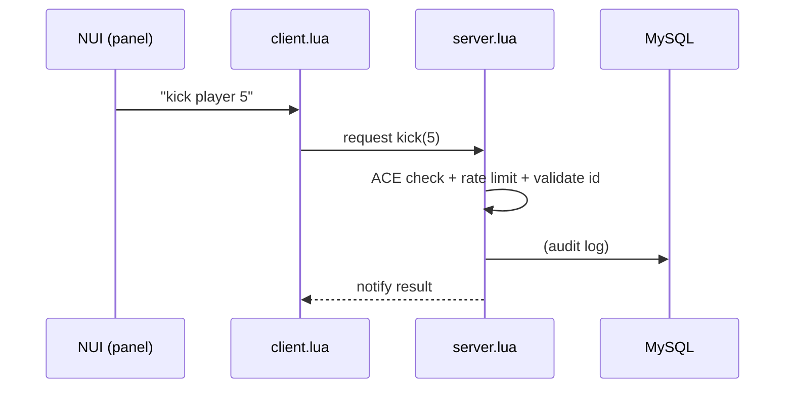

# Security Model

An admin tool that can edit your database is the most sensitive kind of resource
on a server. Vanta Admin is built so that **security never depends on hiding
code** — it depends on server-side enforcement.

## Core principle: the client is never trusted

The NUI and client script only **request** actions. The server validates every
single one before doing anything:

If a player tampers with the client, they still can't do anything they lack the
ACE permission for — because the **server** decides.

## What protects you

| Layer | How |
|-------|-----|
| **ACE permissions** | Every action requires `vanta_admin.<perm>`, checked with `IsPlayerAceAllowed`. |
| **No free-form SQL** | Only tables/columns from `Config.DbTables` + the detected schema are reachable. |
| **Parameterized queries** | All values are passed as query parameters — SQL injection is impossible. |
| **Input validation** | Server IDs, numbers, string lengths are validated/clamped server-side. |
| **Rate limiting** | `Config.RateLimitMs` throttles actions per admin. |
| **Audit log** | Every action recorded (console + DB) with who/what/when. |

## Why the DB editor can't be abused

- Column and table names interpolated into SQL come **only** from your config and
  the real database schema — **never** from the player.
- A value sent from the UI is always a **bound parameter**, never concatenated
  into the query string.
- The `primaryKey` is validated to exist; unknown tables/columns are rejected.

## Going live — checklist

- [ ] ACE permissions set; only trusted identifiers in `group.admin`
- [ ] `sql/install.sql` imported (if using a database)
- [ ] `Config.DbTables` limited to only the tables/columns you really need
- [ ] `editable = 'all'` avoided unless for fully trusted ranks
- [ ] Audit log visible in console/DB after a test action
- [ ] Resource is not placed in a publicly accessible web path
